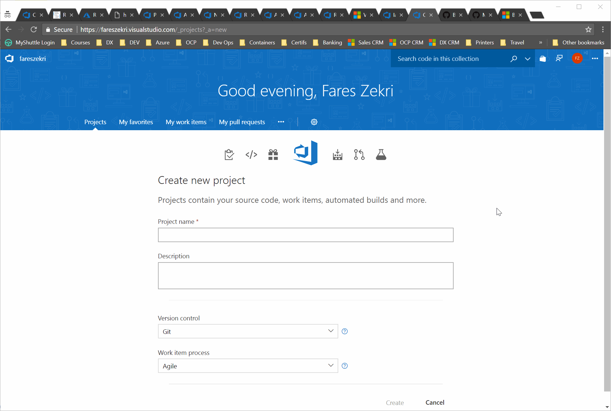
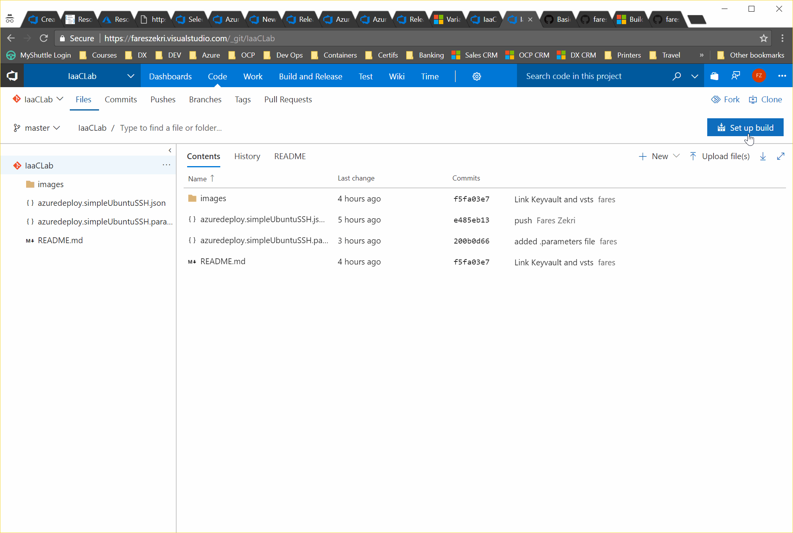
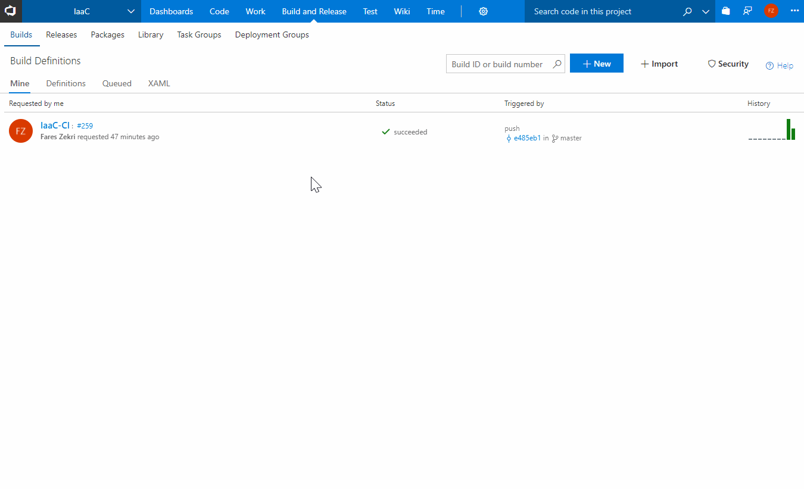
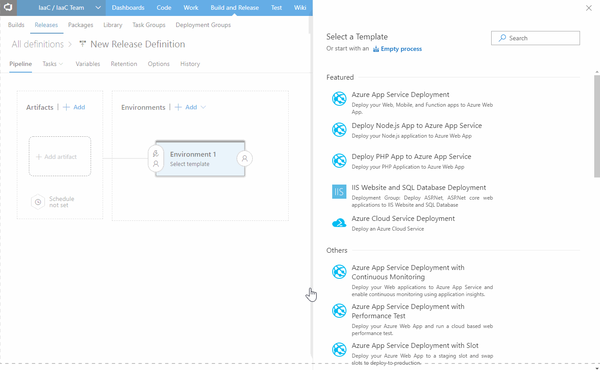

# IaaC-Lab
Prerequisites
------------
* Active Azure account [Create one here if you don't have one](https://azure.microsoft.com/en-us/free/)
* Windows Subsystem for Linux (Recommended) [Installation instructions](https://docs.microsoft.com/en-us/windows/wsl/install-win10) - Putty could also be used refer to the putty doc for ssh key instructions.
* Azure CLI - [Installation instructions](https://docs.microsoft.com/en-us/cli/azure/install-azure-cli?view=azure-cli-latest)
* Active VSTS account - [Create one here if you don't have one](https://go.microsoft.com/fwlink/?LinkId=307137&clcid=0x409&wt.mc_id=o~msft~vscom~getstarted-hero~12778&campaign=o~msft~vscom~getstarted-hero~12778)
* Visual Studio Code - Optional but you'll love it if you haven't already [Free download here](https://code.visualstudio.com/?wt.mc_id=vscom_freedevoffers)

Lab I : Create and deploy a Linux VM with a secure sshkey
------------
In this lab you will see how to secure deploy Linux VMs to your azure account using ARM templates. When you deal with Infrastructure as a code you need to be careful to not store your credentials with your template in your git repo. You could either define and use secret variables in VSTS or you could store your secrets in a Keyvault. For this lab We will use the second option.
1. Login to your azure account : `az login`
2. If you have multiple subscriptions, list then select the appropriate one : 
``` 
az account list -o table
az account set -s <YOUR_SUBSCRIPTION_ID>
```
3. We will deploy a Keyvault to and store the sshkey as a secrets :

```bash
    # Create a ResourceGroup where : 
    az group create -n DevOps -l westeurop
    # create an Azure vault to store your secrets :
    az keyvault create -n <Your_VAULT_NAME>-g DevOps -l westeurope --enabled-for-deployment true  --enabled-for-template-deployment true
    # Create your ssh_key secret :
    az keyvault secret set -n sshkey --vault-name <Your_VAULT_NAME>--value "$(cat ~/.ssh/id_rsa.pub)"
```
4. Create a new Project and import the following  Github repo : https://github.com/fareszekri/IaaC-Lab.git


5. We need to expose the ARM templates to the release agents, for that we will create a build definition that simply copies and publishes the .json files in a drop folder:

6. Link your keyvault to vsts : 
7. Create your release to deploy your vm to Azure : 
8. Check your ssh connection to the newly created vm :
```bash
nic=$(az vm show -n IaaCVM -g IaaCLab  --query networkProfile.networkInterfaces[0].id |  tr -d \")
pip=$(az resource show --ids $nic --query properties.ipConfigurations[0].properties.publicIPAddress.id |  tr -d \")
remotehost=$(az resource show --ids $pip --query properties.ipAddress |  tr -d \")
ssh azureuser@$remotehost
```


